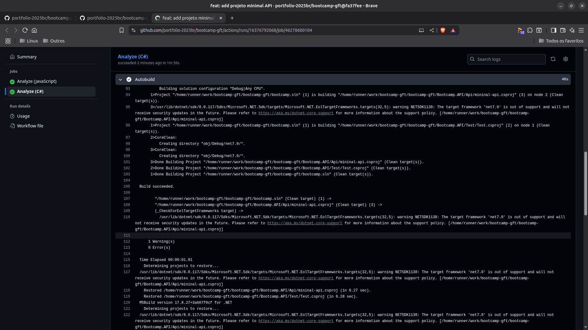

# Minimal API

## Notas

Destaco os seguintes pontos em minha proposta de solução:
- Adicionei um README ao projeto;
- Adicionei rotinas de CI:
  - prettier para formatação e padronização de códigos;
  - commitlint para validação e padronização da mensagem de commit;
  - uso de analisadores estáticos de código (codeQL) para validar a qualidade do código;
  - atualizaçao automática de dependências com uso do Dependabot;
  - testei o projeto localmente;
  - atuei para corrigir erros existentes no projeto original usado como modelo. Por exemplo:
    ```text
    => Assert.IsNotNull(admLogado?.Email ?? "");
    ?? é o null-coalescing operator

    Se o primeiro argumento não for nulo:
      Retorna o primeiro argumento
    Caso contrário
      Retorna o segundo argumento.

    Portanto, o 'Assert' acima nunca irá lidar com um nulo, pois o "??" retorna o email ou "" (que não é nulo).
    ```
## CI em Ação

