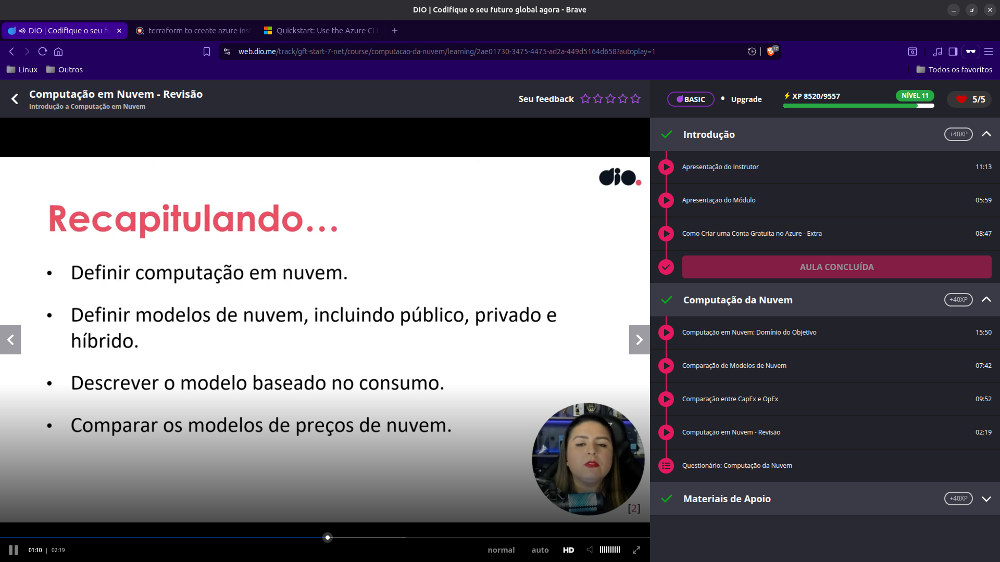
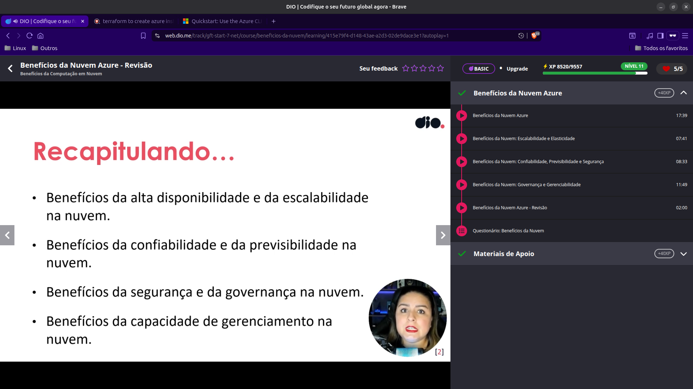

# Criando Máquinas Virtuais na Azure

Criei a máquina virtual usando a GUI e além disto, usando material disponibilizado em
[Microsoft Learn](https://learn.microsoft.com/), iniciei uma jornada IaC (infraestrutura como código).

Escaneei o código IaC para evitar problemas de configuração (naturalmente, devido aos custos, eu ignorei alguns erros).

## Evidências Relevantes

Veja uma abordagem inicial de [Infraestrutura como Código](IaC/) no Azure.

### Outras Evidências:

;

****

;

****

;

## Meu Endosso à Certificação AZ-900

Concordo que a certificação AZ-900 é útil e de interesse para os profissionais de TI. Por esta razão eu me certifiquei:

[Veja todos meus badges neste link](https://www.credly.com/users/claudioandre-br).

