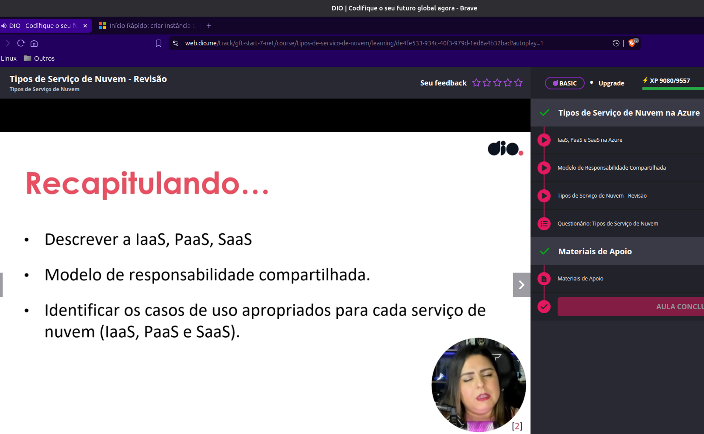

# Criando Banco de Dados na Azure

Fiz um estudo dirigido sobre como criar um banco de dados na nuvem usando a GUI e além disto, usando material disponibilizado em
[Microsoft Learn](https://learn.microsoft.com/), usando IaC (infraestrutura como código).

## Evidências Relevantes

Veja, no desafio II, uma abordagem inicial de uso da [Infraestrutura como Código](../Desafio%20II/IaC/) no Azure.

;

## Meu Endosso à Certificação AZ-900

Concordo que a certificação AZ-900 é útil e de interesse para os profissionais de TI. Por esta razão eu me certifiquei:

[Veja todos meus badges neste link](https://www.credly.com/users/claudioandre-br).

